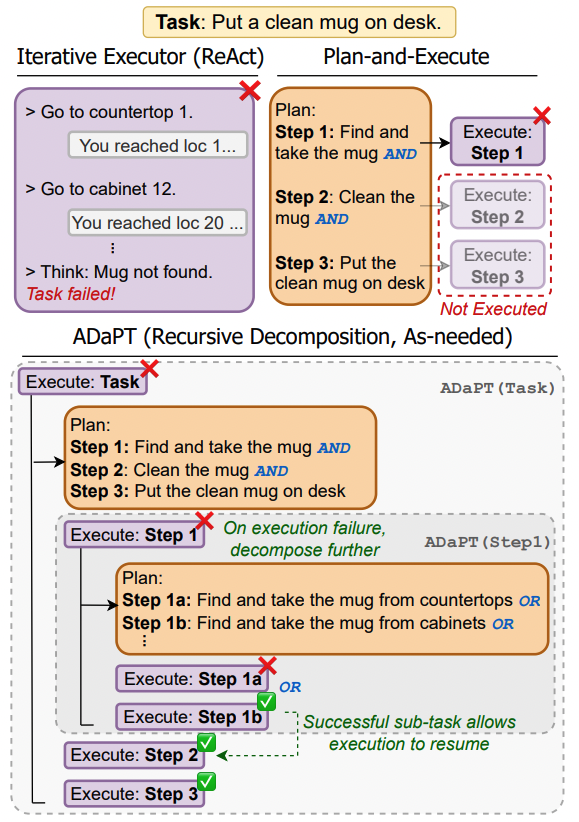
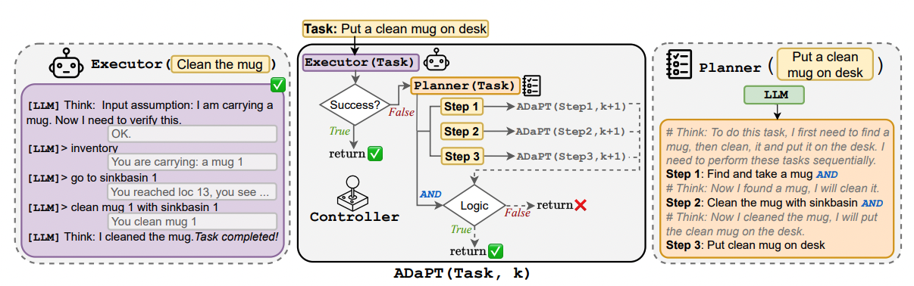

# ADaPT: As-Needed Decomposition and Planning with Language Models
* Authors: [Archiki Prasad](https://archiki.github.io), [Alexander Koller](https://www.coli.uni-saarland.de/~koller/), [Mareike Hartmann](https://scholar.google.dk/citations?user=f-NzaE8AAAAJ&hl=en), [Peter Clark](https://allenai.org/team/peterc), [Ashish Sabharwal](https://allenai.org/team/ashishs), [Mohit Bansal](https://www.cs.unc.edu/~mbansal/), [Tushar Khot](https://allenai.org/team/tushark)
* [Paper](http://arxiv.org/abs/2311.05772)
* **Note:** This is preliminary version of our code. The complete code to run all experiments in the paper will be added shortly.



## Dependencies
This code uses the OpenAI API, please put your access key in `KEY.txt`. To run experiments on ALFWorld, and WebShop please install and set up the environments from the source repositories [alfworld](https://github.com/alfworld/alfworld), [webshop](https://github.com/princeton-nlp/WebShop) respectively. Our code base adds extra functionality on top of ALFWorld, please replace the `alfworld/agents/environment/alfred_tw_env.py` with the provided in our repository. To run the TextCraft environment, please download the [crafting recipes](https://github.com/InventivetalentDev/minecraft-assets/tree/1.16.5/data/minecraft/recipes) and store them in `TextCraft/recipes/`.

## Installation
The simplest way to run our code is to build separate conda environments.
```
conda create --name adaptllm --file requirements.txt python=3.7
conda activate adaptllm
cd ADaPT
```



## Running ADaPT
To run experiments on specific environments using ADaPT (Sec 5 of our paper) please run the environment specific files with the default parameters. The decomposition depth 'd' can be set using `max_depth` variable in all files. See examples below.
```
python run_alfworld.py
python run_textcraft.py
python run_webshop.py
```

## Acknowledgements
We thank the authors and contributors of [ReAct](https://github.com/ysymyth/ReAct) for their public code release. 

## Reference
Please cite our paper if you use our code in your works:
```bibtex

@article{prasad2023adapt,
      author    = "Prasad, Archiki and Koller, Alexander and Hartmann, Mareike and Clark, Peter and Sabharwal, Ashish and Bansal, Mohit and Khot, Tushar",
      title     = "ADaPT: As-Needed Decomposition and Planning with Language Models",
      journal   = "arXiv",
      year      = "2023",}
}
```
